### 1. Sequence alignment

1. dynamic programming
2. Local alignment
3. Global alignment

### 2. Blast 

(https://www.ccg.unam.mx/~vinuesa/tlem/pdfs/Bioinformatics_explained_BLAST.pdf): 
    
**1. Word size:**

When finding a match between a query sequence and a hit sequence, the starting point is the words that the two sequences have in common. A word is simply defined as a number of letters. For blastp the default word size is 3 W=3. If a query sequence has a QWRTG, the searched words are QWR, WRT, RTG. See figure 1 for an illustration of words in a protein sequence. During the initial BLAST seeding, the algorithm finds all common words between the query sequence and the hit sequence(s). Only regions with a word hit will be used to build on an alignment. BLAST will start out by making words for the entire query sequence (see figure 1). 

**2. T-value (threshold):**

For each word in the query sequence, a compilation of neighborhood words, which exceed the threshold of T, is also generated. A neighborhood word is a word obtaining a score of at least T when comparing, using a selected scoring matrix (see figure 2). The default scoring matrix for blastp is BLOSUM62 (for explanation of scoring matrices, see www.clcbio.com/be). The compilation of exact words and neighborhood words is then used to match against the database sequences. After initial finding of words (seeding), the BLAST algorithm will extend the (only 3 residues long) alignment in both directions (see figure 3). Each time the alignment is extended, an alignment score is increases/decreased. When the alignment score drops below a predefined threshold, the extension of the alignment stops. This ensures that the alignment is not extended to regions where only very poor alignment between the query and hit sequence is possible. If the obtained alignment receives a score above a certain threshold, it will be included in the final BLAST result.

**3. E-value: **

The expect value(E-value) can be changed in order to limit the number of hits to the most significant ones. The lower the E-value, the better the hit. The E-value is dependent on the length of the query sequence and the size of the database. For example, an alignment obtaining an E-value of 0.05 means that there is a 5 in 100 chance of occurring by chance alone.

**4. Bit-score**

### 3. Genome barcoding (visualization)

genomes have highly stable combined K-mer frequencies, including eukaryotes, prokaryotes, and even organelles.It is believed that it is Markov chain properties of the prokaryotic DNA that give rise to the barcode property. A fixed order Markov model predicts each base of a DNA sequence using a fixed number of preceding bases in the sequence. For example, a 5th-order model, which is the basis of GeneMark, uses the five previous bases to predict the next base. But .... why do eukaryotic genomes also have (seemingly more complex) barcode properties? Do different (major) regions of a eukaryotic genome also follow Markov chain models or more complex stochastic models? 

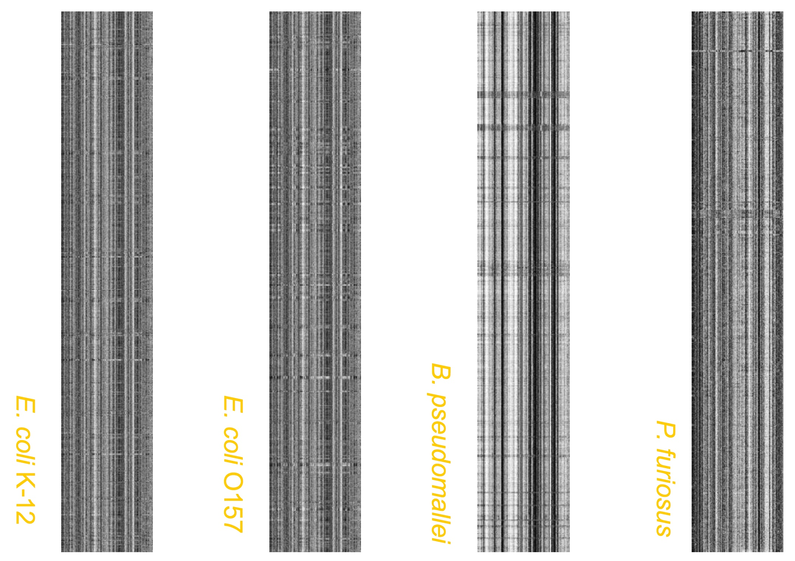

### 4. Gene prediction (ab-initio)

The dimer frequency in protein sequences (di-codon frequencies) is NOT evenly distributed. Some di-codon have higher frequencies in coding region but lower frequencies in non-coding region. In human genome, frequency of dicodon “AAA AAA” is ~1% in coding region versus ~5% in non-coding region.

### 5. Motif finding (promotor, enhancer, terminator, etc)

Measure the conservedness by information content. Existing tools for motif finding include MEME, CUBIC.

### 6. RNA-seq and Microarray: 

1. Expression levels of genes under different conditions 

2. Biological networks (clustering of co-expressed genes, either co-activated or co-repressed). For example, we have RNAseq data of a series of times under certain condition. For each gene, we have a vector (T1, T2, T3…). We can use algorithms such as Prim’s algorithm to cluster these vectors (genes).

3. Correlation vs Euclidean distances: If two genes are always co-activated or co-repressed, they have very small Euclidean distance. However, sometimes two genes are still highly correlated even the Euclidean distance is large, because there might be lag between expression of gene A and gene B.

4. Classfication: by machine learning of expression data between different samples (such as cancer cells and normal cells), algorithm such as support vector machine can be trained to classify unknown samples.

### 7. Next-generation sequencing

**1. Illumina sequencing: **https://www.illumina.com/documents/products/techspotlights/techspotlight_sequencing.pdf

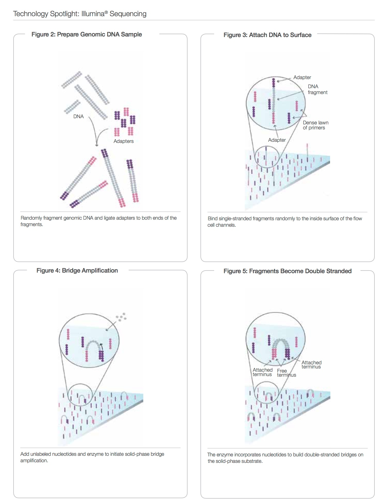
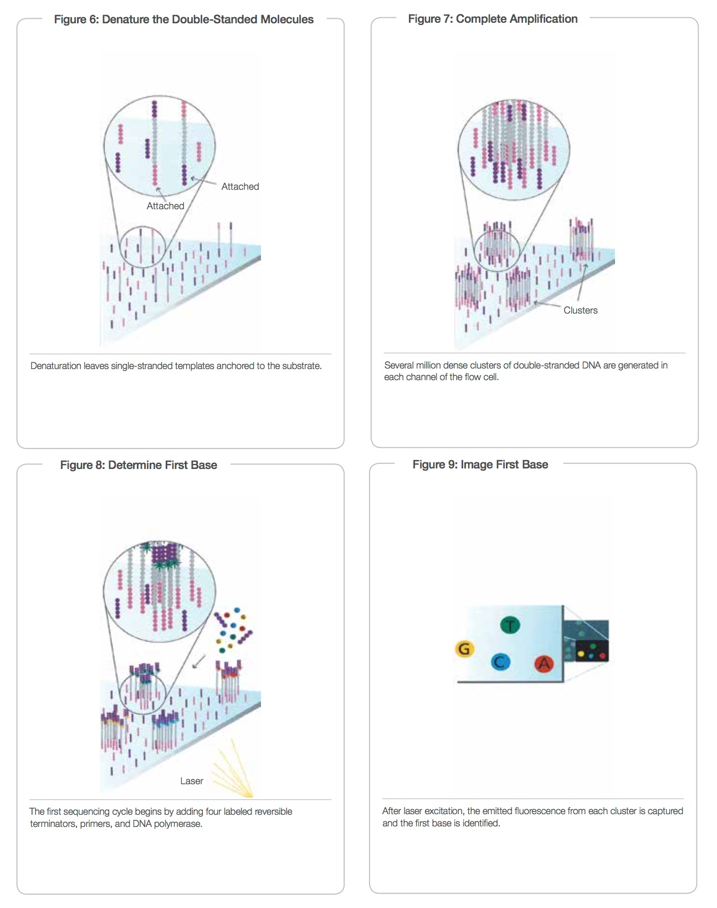
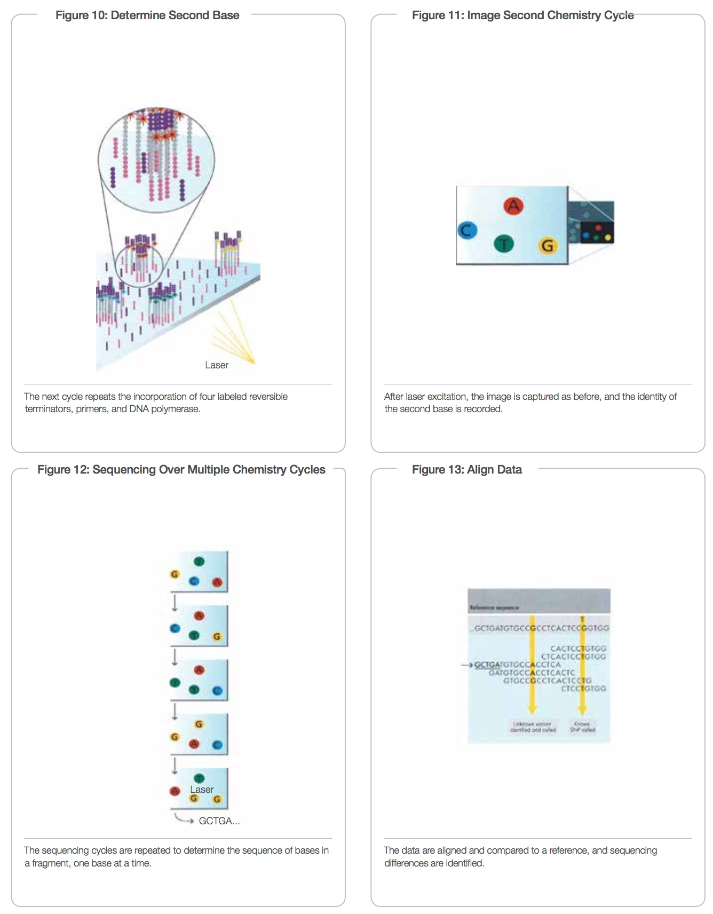

**2. RNA-seq and ChIP-seq**

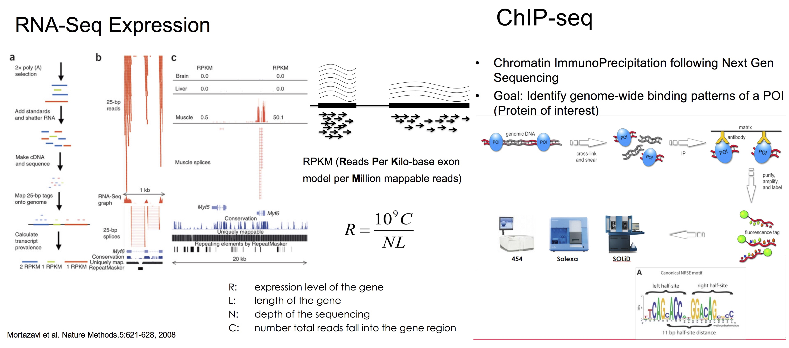

**3. Short-read assembly: De Bruijn Graph**

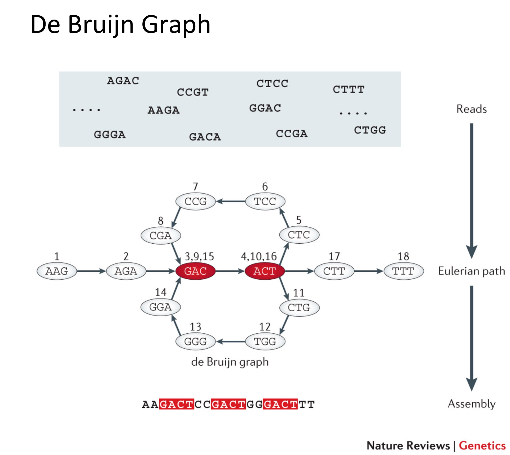

**4. 	Data analysis: **

1. Sequencing Quality Score: 

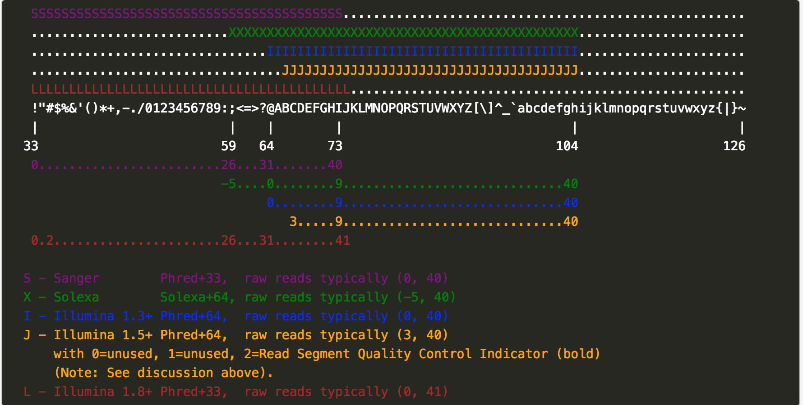

2. SAM files (mapping files) : http://samtools.github.io/hts-specs/SAMv1.pdf
		
3. VCF (Variant Call Format):

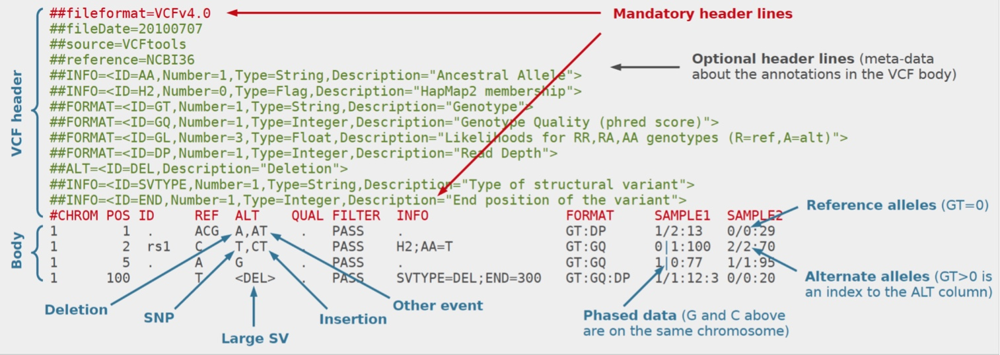

### 8. Proteomics

1. Amino acids:

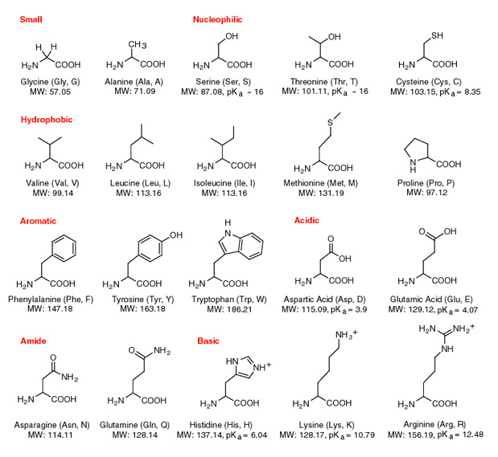

2. Mass Spectrometry

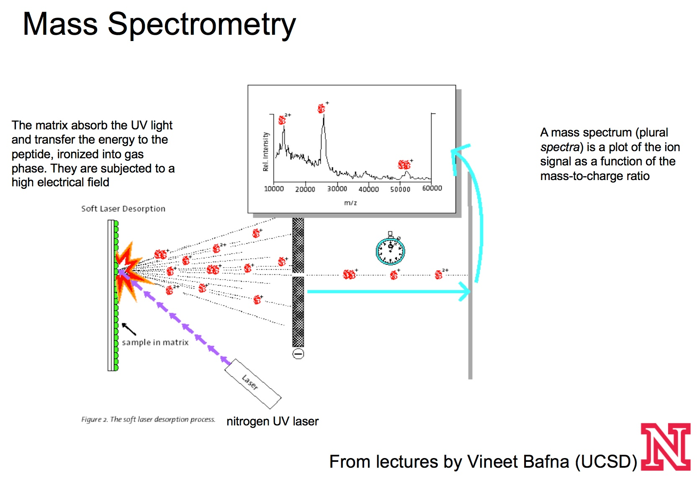

3. Tandem Mass Spectrometry

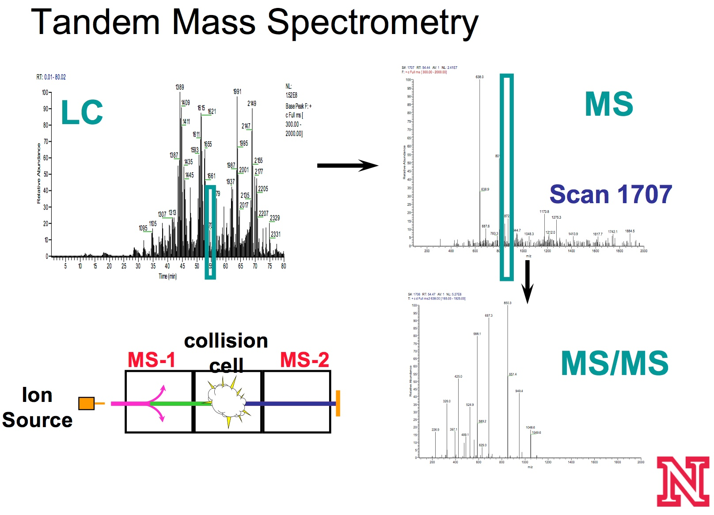

4. De Novo Sequencing Using Spectrum Graph Approach:
      * Each node of the graph represents a peak in the spectrum 
      * Two nodes have an edge if and only if the two corresponding peaks are distanced with the mass of an amino acid 
      * The path that connects the two ends corresponds to a feasible solution 


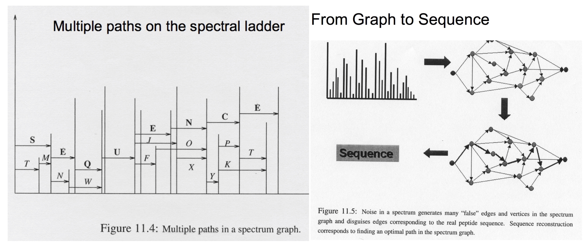
